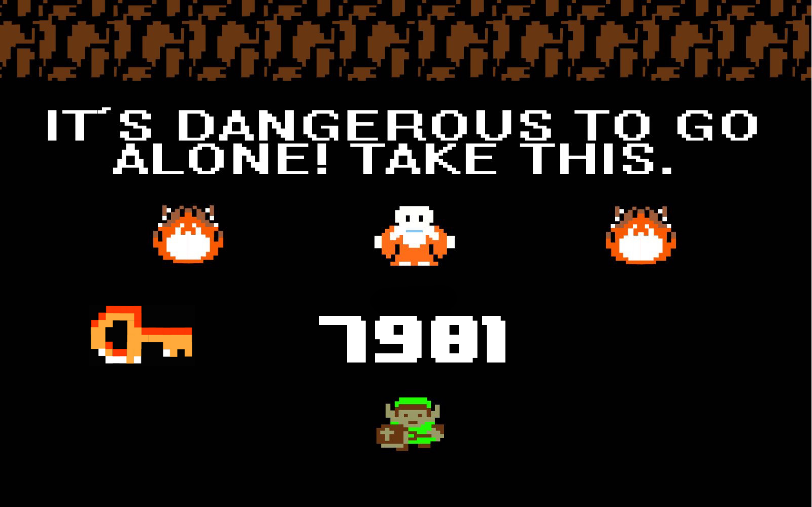
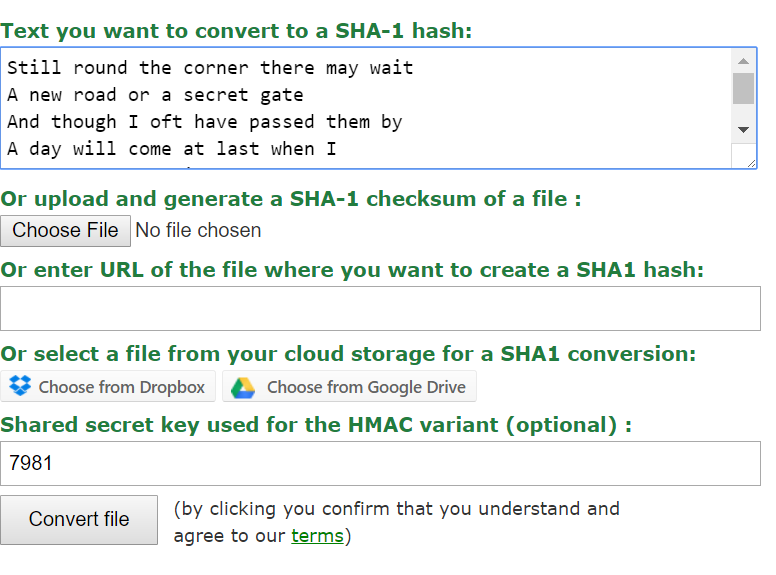

## Synopsis

Este es un divertido ejercicio que pone aprueba tus conocimientos de criptografía, conversiones hexadecimales a ASCII y programación, completando pruebas que te llevan a resolver un ejercicio final

## Procedimiento

El ejercicio solo te da una frase que dice riddle me this is "687474703a2f2f6772616e6470612d6368616c6c656e67652e6769746875622e696f2f"

## Conversion hexadecimal a ascii
Si notamos es una cadena hexadecimal que podemos convertir en ASCII el código de conversión esta disponible en este repocitorio
Una vez convertida la cadena hexadecimal "687474703a2f2f6772616e6470612d6368616c6c656e67652e6769746875622e696f2f" a ASCII el resultado es http://grandpa-challenge.github.io/ asi que nos dirigimoa a dicho sitio

## OH una llave!!!
Esta imagen solo dice es peligroso ir solo, toma esto: 7981, me pregunto para que será ese número?, Hmmm ,será la clave secreta compartida utilizada para la variante HMAC de SHA1???

<tr>
<td>

</td>
</tr>

## Inspeccionando el codigo

Si presionamos las teclas Control+Shift+I podemos inspeccionar el código y ver lo siguiente, aquí las pistas son el url grandpa-challenge.appspot.com, SHA1 y HMAC

```sh
	<html>
    <head>
    <title>SHA1</title>
    <style></style>
    <!--grandpa-challenge.appspot.com-->
    <!--grandpa-challenge.appspot.com-->
    <!--grandpa-challenge.appspot.com-->
    <!--grandpa-challenge.appspot.com-->
    <!--
    Still round the corner there may wait
    A new road or a secret gate
    And though I oft have passed them by
    A day will come at last when I
    Shall take the hidden paths that run
    West of the Moon, East of the Sun.
    -->
    <!--grandpa-challenge.appspot.com-->
    <!--grandpa-challenge.appspot.com-->
    <!--grandpa-challenge.appspot.com-->
    <!--grandpa-challenge.appspot.com-->
    </head>
    <body>
    
    </body>
    </html>
```

## Generando el Hash 
Me hubiera gustado generar mi propia herramienta pero por cuestiones de tiempo podemos usar la herramienta http://hash.online-convert.com/sha1-generator. Este generador de hash en línea convierte  datos sensibles como contraseñas a un hash SHA-1. Para mayor seguridad del proceso de cifrado puede definir una clave HMAC la cual se nos dio en la imagen.
Al procesarlo nos genera la cadena f4d8d7f97ffa63e4309320c45b5e6166a784cfaa la cual introducimos en el textbox del url http://grandpa-challenge.appspot.com/


<tr>
<td>

</td>
</tr>

## Problema

Una vez adentro vemos lo siguiente:

Usted recibe un crédito C en una tienda local y le gustaría comprar dos artículos. En primer lugar camina a través de la tienda y crea una lista L de todos los elementos disponibles. De esta lista le gustaría comprar dos artículos que sumen el valor total del crédito. La solución que usted proporciona consistirá de los dos números enteros que indican las posiciones de los artículos en su lista (elnúmero más pequeño primero).

### Entrada

La primera línea de entrada da el número de casos, N. N casos de prueba siguen. Para cada caso de prueba habrá:

* Una línea que contiene el valor C, la cantidad de crédito que tiene en la tienda.
* Una línea que contiene el valor I, el número de elementos en el almacén.
* Una línea que contiene una lista separada por espacios de I enteros. Cada entero P indica el precio de un elemento en el almacén.
* Cada caso de prueba tendrá exactamente una solución.

### Salida

Para cada caso de prueba, genere una línea que contiene "Caso # x:" seguido de los índices de los dos artículos cuyo suma es el precio del crédito de la tienda. El índice inferior debe ser la primera salida .

Muestra:

```sh
Entrada
3
100
3
5 75 25
200
7
150 24 79 50 88 345 3
8
8
2 1 9 4 4 56 90 3

Salida
Caso # 1: 2 3
Caso # 2: 1 4
Caso # 3: 4 5
```

## Finalmente

El código esta hecho en java y lo puedes ver en el repositorio....HAPPY CODING!!!